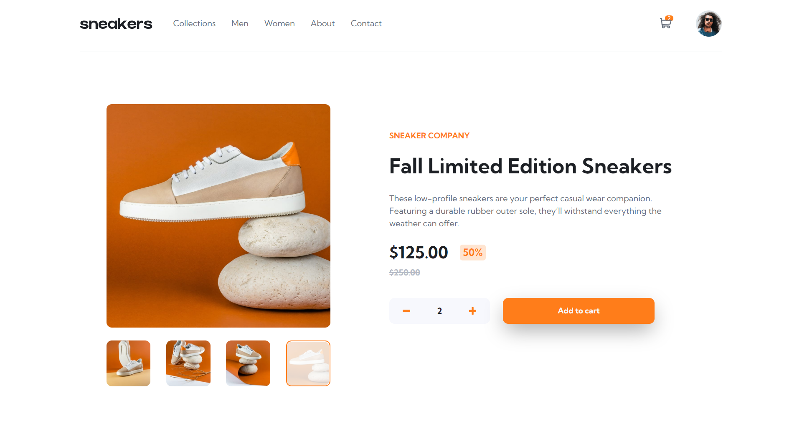

# Frontend Mentor - E-commerce product page solution

This is a solution to the [E-commerce product page challenge on Frontend Mentor](https://www.frontendmentor.io/challenges/ecommerce-product-page-UPsZ9MJp6).

## Table of contents

- [Overview](#overview)
  - [The challenge](#the-challenge)
  - [Screenshot](#screenshot)
  - [Links](#links)
- [My process](#my-process)
  - [Built with](#built-with)
  - [What I learned](#what-i-learned)
- [Author](#author)

## Overview

### The challenge

Users should be able to:

- View the optimal layout for the site depending on their device's screen size
- See hover states for all interactive elements on the page
- Open a lightbox gallery by clicking on the large product image
- Switch the large product image by clicking on the small thumbnail images
- Add items to the cart
- View the cart and remove items from it

### Screenshot



### Links

- Solution URL: [Add solution URL here](https://your-solution-url.com)
- Live Site URL: [Add live site URL here](https://your-live-site-url.com)

## My process

### Built with

- Semantic HTML5 markup
- CSS custom properties
- Flexbox
- CSS Grid
- Large-screen-first workflow
- javscript

### What I learned ?

I learned some awesome stuff like how to build the lightbox and update the UI dynamically based on user interactions, also learned how to make my personal framework like building a class just to center any element by setting the top and left to 50% and translate it with transform translate as showing in code below.

```css
.center-element {
  position: absolute;
  top: 50%;
  left: 50%;
  transform: translate(-50%, -50%);
  -webkit-transform: translate(-50%, -50%);
  -moz-transform: translate(-50%, -50%);
  -ms-transform: translate(-50%, -50%);
  -o-transform: translate(-50%, -50%);
}
```

## Author

- Frontend Mentor - [@ibrahim11elian](https://www.frontendmentor.io/profile/ibrahim11elian)
- Facebook : [@ibrahim11ahmed](https://www.facebook.com/ibrahim11ahmed/)
- Linkedin : [@ibrahim-ahmed-a8bba9196](https://www.linkedin.com/in/ibrahim-ahmed-a8bba9196/)
